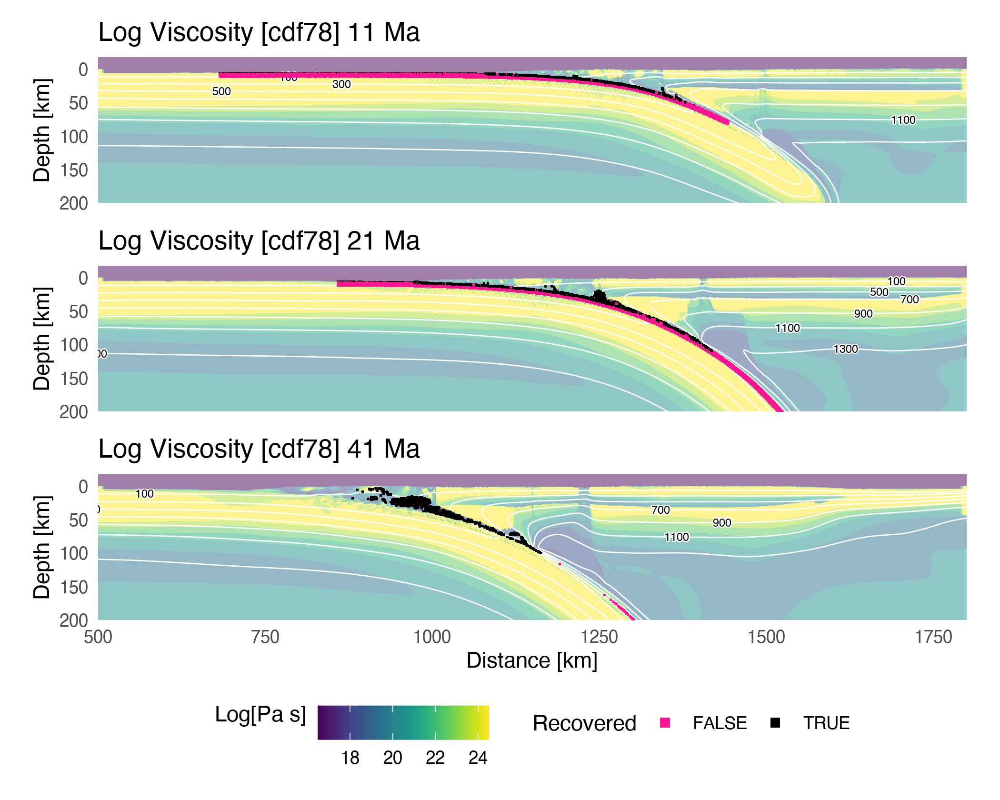

```{r echo=FALSE, message=FALSE}
# Some recommended settings
knitr::opts_chunk$set(
  echo=FALSE,
  message=FALSE,
  fig.pos='h',
  out.extra="",
  fig.align='center',
  out.width='98%'
)

# Run R code

# Load functions and libraries
source('../functions.R')

# Load numerical model parameters
load('../data/mods.RData')

# Read Penniston-Dorland et al., 2015 dataset
pd15 <- readr::read_delim('../data/PD15.tsv', delim = '\t', col_types = 'cddcccd')
pd15 <- pd15[1:nrow(pd15)-1,]

tibble(T = sort(pd15$temperature)) %>%
mutate(cdf = (row_number()-1)/n()) -> pd15T

# Get file paths
paths <- list.files('../data/k10', full.names = T)
models <- paths %>% stringr::str_extract('cd.[0-9]+')

# Load classified markers
for (i in paths) load(i)

# Save as list
purrr::map(ls()[grep('classified', ls())], ~get(.x)) %>%
purrr::set_names(models) -> m

rm(list = ls()[grep('classified', ls())])

# Summarise pressure CDF
purrr::map_df(m, ~{
  .x$marx %>%
  filter(recovered == TRUE)
}, .id = 'model') %>%
group_by(id, model) %>%
summarise(maxP = max(P), .groups = 'keep') %>%
left_join(select(mods, model, z1100), by = 'model', .before = 'data') %>%
group_by(z1100) %>%
nest() -> d1

maxP <- d1$data %>%
purrr::map_df(~.x %>% arrange(maxP) %>% mutate(cdf = (row_number()-1)/n())) %>%
arrange(model) %>%
left_join(select(mods, model, z1100), by = 'model')

# Summarise temperature CDF
purrr::map_df(m, ~{
  .x$marx %>%
  filter(recovered == TRUE)
}, .id = 'model') %>%
group_by(id, model) %>%
summarise(maxT = max(T), .groups = 'keep') %>%
left_join(select(mods, model, z1100), by = 'model', .before = 'data') %>%
group_by(z1100) %>%
nest() -> d2

maxT <- d2$data %>%
purrr::map_df(~.x %>% arrange(maxT) %>% mutate(cdf = (row_number()-1)/n())) %>%
arrange(model) %>%
left_join(select(mods, model, z1100), by = 'model')

# Number of markers by model
purrr::map_df(m, ~{
  .x$marx %>%
  slice(1) %>%
  ungroup() %>%
  summarise(n = n())
}, .id = 'model') -> marx.summary

mods.summary <- mods %>%
select(model, phi, zc, z1100, age, cv) %>%
left_join(marx.summary, by = 'model')

# Summarise marker stats by model
purrr::map_df(m, ~{
  .x$mc %>%
  purrr::map_df(~purrr::pluck(.x, 'stats') %>% mutate('ratio' = recovered/(recovered+subducted)), .id = 'run') %>%
  summarise(
    mean.rec = mean(recovered),
    sd.rec = sd(recovered),
    mean.sub = mean(subducted),
    sd.sub = sd(subducted),
    mean.ratio = mean(ratio),
    sd.ratio = sd(ratio),
    mean.max.P.rec = mean(max.P.rec),
    sd.max.P.rec = sd(max.P.rec),
    mean.max.T.rec = mean(max.T.rec),
    sd.max.T.rec = sd(max.T.rec)
  )
}, .id = 'model') -> stats.summary

# Combine tables
d <- mods.summary %>% left_join(stats.summary, by = 'model')

# Load markers and grids for model cdf78
load('../data/k10/cdf78_k10_marx_classified.RData')
# Max P summary for CDFs
cdf78.marx.classified$mc %>%
purrr::map_df(~.x$cdfP, .id = 'run') -> maxP.cdf78
# Max T summary for CDFs
cdf78.marx.classified$mc %>%
purrr::map_df(~.x$cdfT, .id = 'run') -> maxT.cdf78
```

# Introduction

Maximum metamorphic conditions, in terms of pressure and temperature (PT), have now been estimated for hundreds of high-pressure rocks exhumed from subduction zones [@agard2018; @penniston2015]. This dataset (the *rock record*) is the only tangible record of PT conditions experienced by rocks during deformation and chemical processing in subduction systems [e.g., @agard2009]. Together with geophysical imaging [@naif2015; @hyndman2003; @syracuse2006; @ferris2003; @rondenay2008], surface heat flow [@kerswell2021; @currie2006; @gao2014; @wada2009; @hyndman2005], and forward numerical modelling [@gerya2002; @sizova2010; @gerya2006; @gerya2008; @syracuse2010; @yamato2007; @yamato2008; @hacker2003; @peacock1990; @peacock1996; @mckenzie1969], the rock record underpins contemporary views of subduction geodynamics [@agard2009; @agard2018; @bebout2007]. However, two interesting observations emerge from the rock record that remain contradictory or unexplained by geophysical observations and numerical models.

First, temperature estimates for rocks are, on average, significantly warmer than widely cited numerical models of subduction [for a given depth, @penniston2015]. This significant temperature discrepancy implicates both geodynamic modelling and thermobarometry alike. Potential sources and magnitudes of uncertainty are discussed by @penniston2015, @abers2017, @kohn2018, and @vankeken2019 with conflicting arguments. Because subduction zone research relies on forward numerical modelling to generate and test hypotheses about temperature-dependent processes (metamorphism, mechanics, seismicity, volcanism, and chemical fluxes), further investigation into this discrepancy is warranted. In either case, currently only one set of numerical experiments from @syracuse2010 has been systematically compared to the rock record. Comparing the rock record with other widely used geodynamic codes [e.g. `I2VIS`, @gerya2003] may resolve or uncover recurrent and/or new incongruities.

Second, the probability of recovering high-pressure rocks from depths beyond `r round(tail(pd15$pressure[pd15$cumulative <= 0.8], 1), 1)` $GPa$ rapidly diminishes ([@fig:cdf]). [@fig:cdf] implies a global recovery depth limit for high-pressure rocks that is not yet understood. Perhaps coincidentally, hypotheses of commonly thin backarcs [@currie2006] and common depths of mechanical coupling along the subduction interface [@furukawa1993; @wada2009] may help explain the recovery depth limit implied by [@fig:cdf] [@kerswell2020]. If subduction zone thermal structure is related to maximum recovery depth limits for high-pressure rocks, explaining the curve in [@fig:cdf] is key to understanding the temperature discrepancy sketched above. However, such commonalities among subduction zone thermal structure and mechanical coupling was recently scrutinized by interpolations of surface heat flow [@kerswell2021].

![Cumulative probability of peak metamorphic pressures (a) and temperatures (b) for a global compilation of exhumed blueschists and eclogites. The rock record implies eighty percent (grey shaded regions) of rocks are recovered from $\leq$ `r round(tail(pd15$pressure[pd15$cumulative <= 0.8], 1), 1)` $GPa$ and $\leq$ `r round(tail(pd15T$T[pd15T$cdf <= 0.8], 1))` $^{\circ} C$. Note the abrupt change in slope at `r round(tail(pd15$pressure[pd15$cumulative <= 0.8], 1), 1)` $GPa$. Data from @penniston2015.](../figs/pd15_cdf.png){#fig:cdf}

This study attempts to answer the following questions: 1) what is the global range of maximum recovery depths and 2) maximum metamorphic conditions for subducted oceanic crust and seafloor sediments? We first collectively trace more than one million markers in geodynamic numerical models of 64 active continental margins [from @kerswell2020] and classify recovered (vs. subducted) markers using unsupervised machine learning. Next, maximum metamorphic conditions of recovered markers are calculated and compared to the rock record. We find that all numerical models underpredict the distribution of maximum marker pressures compared to the rock record. Maximum marker temperatures are consistent with the rock record only for numerical models with very thin ($\leq 62~km$) upper plate lithospheres. Finally, we calculate cumulative probability curves of recovered markers and discuss (in)consistencies with the rock record and their geodynamic implications.

\clearpage

# Methods {#sec:methods}

This study presents a dataset of Lagrangian markers (described below) from the numerical experiments of @kerswell2020. The numerical experiments simulate 64 oceanic-continental subduction systems with variable oceanic plate age, convergence velocity, and upper plate (continental) lithospheric thickness. The range of oceanic plate ages and convergence velocities broadly represent the modern global subduction system [@syracuse2006; @wada2009]. Initial conditions were modified from previous studies of active margins [@sizova2010; @gorczyk2007]. The code, `I2VIS`, models visco-plastic flow of geologic materials by solving three conservative equations of mass, energy, and momentum on a fully-staggered finite difference grid with a *marker-in-cell* technique [@gerya2003; @harlow1965]. Further details about the initial setup and boundary conditions, rheologic model, metamorphic (de)hydration reactions, are in @kerswell2020. Details about the marker-in-cell technique are in @gerya2003 and @gerya2019.

In this section we first define Lagrangian markers (now referred to as markers) and briefly elaborate on their usefulness in understanding fluid flow---including geodynamic problems like subduction. We then detail the maths and decisions involved in our marker classification algorithm, which we use to classify `r format(round(sum(marx.summary$n)), big.mark = ',')` markers from 64 numerical experiments of @kerswell2020 as either subducted or recovered based on characteristics of their PTt paths.

## Lagrangian markers

Markers are mathematical objects representing discrete parcels of fluid flowing in a continuum [@harlow1962; @harlow1964]. Imagine tracking millions of parcels of air as they collectively move around an air foil. Each marker would experience a different flow path and pressure history relative to its neighbors. For example, some parcels of air may spin off and cause turbulence, while others move orderly with their neighbors around the foil. In this analogy, knowing which parcels experience turbulence, perhaps based on some characteristic of a parcel's flow path, is useful information for aerodynamic testing.

The analogy above highlights the representative advantage of markers. That is, markers record physical changes to the continuum *from the perspective of the fluid* [@harlow1962]. "Tracing" markers (saving marker states through time) in a numerical geodynamic model is useful for understanding subduction dynamics like tracing air parcels is useful for understanding aerodynamics. It is necessary, however, to first accept implicit simplifications and uncertainties (known and unknown) about the geodynamic continuum. For example, fluids like Earth's atmosphere and oceans are often modeled as incompressible fluids [@batchelor1953; @boussinesq1897]. Uncertainties are especially rich in the petrologic model governing phase changes [@ito1971; @schmidt1998] and its effects on the highly non-linear rheologic model relating stress and strain by empirical flow laws [@hilairet2007; @ranalli1995; @karato1993; @turcotte2002]. See @kerswell2020 for details. Nonetheless, insofar as subducting crustal rocks on earth behave like an incompressible visco-plastic fluid [as parameterized by @gerya2019; @kerswell2020; @gerya2003], principled comparisons between marker PTt paths and the rock record [e.g. Figure 1, @agard2018; @penniston2015] may be made.

Markers also have a distinct numerical advantage in geodynamic cases. Unlike air parcels flowing in a relatively homogeneous atmosphere (air foil aside), markers are deforming in a partly layered, partly chaotic, visco-plastic continuum representing the interface between the top of subducting oceanic crust and the mantle it sinks into (often called the subduction interface). Current models of the subduction interface epitomize a geologic continuum with complex geometry, sharp thermal, chemical, and strain gradients, strong advection (high Peclét number), and abundant fluid flow [@agard2016; @agard2018; @bebout2002; @bebout2007; @gerya2003; @syracuse2010; @penniston2015]. Markers greatly improve solution accuracy and stability in such cases by interpolating and updating thermal, chemical, and velocity fields during each timestep [@gerya2003; @gerya2019; @moresi2003].

## Maker classification

On average, `r format(round(mean(marx.summary$n)), big.mark = ',')` markers are selected from within a 760 $km$ wide and 8 $km$ deep section of oceanic crust and seafloor sediments ([@fig:init]). Tracing then proceeds for a number of timesteps $t = \{1, 2, \dots, t_{dur}\}$, where $t_{dur} = 79$. Seventy-nine timesteps is sufficient for markers to be subducted deeply ($\geq 200~km$) from their initial positions, regardless of subduction rate (see @sec:tdur). From this set of markers, $x_i = \{x_1, x_2, \dots , x_n\}$, only markers *recovered* from the subducting slab are relevant for comparison to PT estimates of natural rocks. The main challenge, therefore, is to first classify markers as either *subducted* or *recovered* without an inherited class label.

At the heart of our marker classification algorithm is a finite Gaussian mixture model (GMM) fit by Expectation-Maximization [EM, @dempster1977]. Please note that GMM fit by EM is a general purpose clustering algorithm broadly used in pattern recognition, anomaly detection, and estimating complex probability distribution functions [e.g., @banfield1993; @celeux1995; @figueiredo2002; @fraley2002; @vermeesch2018]. We derive GMM in @sec:gmm and EM in @sec:em.

Before deriving the details of marker classification, we hypothesize that subducted and recovered markers may be distinguished by their PTt paths. If true, clustering algorithms like GMM may reliably classify markers by (dis)similarity along any number of dimensions computed from marker PTt paths [e.g., @dy2004].

{#fig:init}

\clearpage

### Gaussian mixture model {#sec:gmm}

Let the traced markers represent a $d$-dimensional array of $n$ random independent variables $x_i \in \mathbb{R}$. Assume markers $x_i$ were drawn from $k$ discrete probability distributions with parameters $\Phi$. The probability distribution of markers $x_i$ can be modeled with a mixture of $k$ components:

$$ p(x_i | \Phi) = \sum_{j=1}^k \pi_j p(x_i | \Theta_j) $$ {#eq:gmix}

where $p(x_i | \Theta_j)$ is the probability of $x_i$ under the $j^{th}$ mixture component and $\pi_j$ is the mixture proportion representing the probability that $x_i$ belongs to the $j^{th}$ component $(\pi_j \geq 0; \sum_{j=1}^k \pi_j = 1)$.

Assuming $\Theta_j$ describes a Gaussian probability distributions with mean $\mu_j$ and covariance $\Sigma_j$, @eq:gmix becomes:

$$ p(x_i | \Phi) = \sum_{j=1}^k \pi_j \mathcal{N}(x_i | \mu_j, \Sigma_j) $$ {#eq:mix}

where

$$ \mathcal{N}(x_i | \mu_j, \Sigma_j) = \frac{exp\{ -\frac{1}{2}(x_i - \mu_j)(x_i - \mu_j)^T \Sigma_j^{-1}\}}{\sqrt{det(2 \pi \Sigma_j)}} $$ {#eq:gauss}

The parameters $\mu_j$ and $\Sigma_j$, representing the center and shape of each cluster, are estimated by maximizing the log of the likelihood function, $L(x_i | \Phi) = \prod_{i=1}^n p(x_i | \Phi)$:

$$ log~L(x_i | \Phi) = log \prod_{i=1}^n p(x_i | \Phi) = \sum_{i=1}^n log \left[ \sum_{j=1}^k \pi_j p(x_i | \Theta_j) \right] $$ {#eq:loglik}

Taking the derivative of @eq:loglik with respect to each parameter, $\pi$, $\mu$, $\Sigma$, setting the equation to zero, and solving for each parameter gives the Maximum Likelihood Estimators (MLE):

$$ \begin{aligned}
  N_j &= \sum_{i=1}^n \omega_{ij} \\
  \pi_j &= \frac{N_j}{n} \\
  \mu_j &= \frac{1}{N_j} \sum_{i=1}^n \omega_{ij} x_i \\
  \Sigma_j &= \frac{1}{N_j} \sum_{i=1}^n \omega_{ij} (x_i - \mu_j)(x_i - \mu_j)^T
\end{aligned} $$ {#eq:mle}

where $\omega_{ij}$ ($\omega_{ij} \geq 0; \sum_{j=1}^k \omega_{ij} = 1$) are membership weights representing the probability of an observation $x_i$ belonging to the $j^{th}$ Gaussian and $N_j$ represents the number of observations belonging to the $j^{th}$ Gaussian. Please note that $\omega_{ij}$ is unknown for unlabelled datasets, like the unclassified markers, so MLE cannot be computed with @eq:mle. The solution to this problem in derived in @sec:em.

General purpose functions in the `R` package `Mclust` [@scrucca2016] are used to fit Gaussian mixutre models. After @banfield1993, covariance matrices $\Sigma$ in `Mclust` are parameterized to be flexible in their shape, volume, and orientation [@scrucca2016]:

$$ \Sigma_j = \lambda_j D_j A_j D_j^T $$ {#eq:eigen}

where $D_j$ is the orthogonal eigenvector matrix, $A_j$ and $\lambda_j$ are diagonal matrices of values proportional to the eigenvalues. This implementation allows fixing one, two, or three geometric elements of the covariance matrices. That is, the volume $\lambda_j$, shape $A_j$, and orientation $D_j$ of Gaussian clusters can change or be fixed among all $k$ clusters [e.g., @celeux1995; @fraley2002]. Fourteen parameterizations of @eq:eigen are tried, representing different geometric combinations of the covariance matrices $\Sigma$ [see @scrucca2016] and the Bayesian Information Criterion [BIC, @schwarz1978] is computed. The best parameterization for @eq:eigen is chosen by BIC.

![Marker classification example for model cdf78. GMM groups `r format(round(marx.summary$n[marx.summary$model == 'cdf78']), big.mark = ',')` markers into ten clusters according to each marker's maximum pressure and sum of all pressure changes along its PTt path. If a cluster's centroid is below the median $sumdP$ or $maxP$ of all markers (within the grey shaded region), it is classified as recovered (b). The size of centroid squares are proportional to the number of markers in a cluster.](../figs/cdf78_class.png){#fig:class}

\clearpage

### Expectation-Maximization fitting of Gaussian Mixtures {#sec:em}

The EM algorithm estimates GMM parameters by initializing $k$ Gaussians with parameters $(\pi_j, \mu_j, \Sigma_j)$, then iteratively computing membership weights with @eq:posterior (E-step) and updating Gaussian parameters with @eq:mle (M-step) until convergence [@dempster1977].

The *expectation* (E-)step involves a "latent" multinomial variable $z_{ij} \in \{1, 2, \dots, k\}$ representing the unknown classifications of $x_i$ with a joint distribution $p(x_i,z_{ij}) = p(x_i | z_{ij})p(z_{j})$. Membership weights $\omega_{ij}$ are equivalent to the conditional probability $p(z_{ij} | x_i)$, which represents the probability of observation $x_i$ belonging to the $j^{th}$ Gaussian. Given initial guesses for $k$ sets of Gaussian parameters $\pi_j$, $\mu_j$, $\Sigma_j$, membership weights are computed using Bayes Theorem (E-step):

$$ p(z_{ij} | x_i) = \frac{p(x_i | z_{ij})p(z_{ij})}{p(x_i)} = \frac{\pi_j \mathcal{N}(\mu_j, \Sigma_j)}{\sum_{j=1}^k \pi_j \mathcal{N}(\mu_j, \Sigma_j)} = \omega_{ij} $$ {#eq:posterior}

and new Gaussian estimates are computed with $\omega_{ij}$ ([@eq:mle]) during the *maximization* (M-)step.

### Feature selection

EM is sensitive to local optima and initialization [@figueiredo2002], so a number of features were computed from marker PTt paths and tested in combination. Redundant or useless features [e.g., @dy2004] were filtered out. We settled on two features:

$$\begin{aligned}
  maxP \leftarrow \max_{1 \leq t \leq t}P \\
  sumdP \leftarrow \sum_{1}^{t_{dur}} dP
\end{aligned}$$ {#eq:bivar}

where $maxP$ and $sumdP$ represent the maximum pressure attained each marker's PTt path and the sum total of all pressure changes along each marker's PTt path, respectively. Up to ten Gaussian components are fit to the bivariate mixture model described by @eq:mix and @eq:bivar using EM ([@eq:posterior; @eq:mle]). This clustering step gives markers $x_i$ class labels $z_i \in \{1, \dots, k\}$ representing assignment to one of $k$ clusters ([@fig:class]a). Next, we describe our decisions in determining which clusters (if any) represent recovered markers.

![Example of metamorphic conditons for markers recovered from model cdf78. Maximum pressures for recovered markers (solid curves) range from `r round(head(maxP.cdf78$maxP[maxP.cdf78$cdf <= 0.8], 1)/1e4, 1)` to `r round(tail(maxP.cdf78$maxP[maxP.cdf78$cdf <= 0.8], 1)/1e4, 1)` (a) and only marginally overlap with the rock record (dotted curves). However, maximum temperatures for recovered markers range from `r round(head(maxT.cdf78$maxT[maxT.cdf78$cdf <= 0.8], 1)-273)` to `r round(tail(maxT.cdf78$maxT[maxT.cdf78$cdf <= 0.8], 1)-273)` (b) and show better agreement with the rock record than (a). PD15 dataset from @penniston2015.](../figs/cdf78_meta.png){#fig:meta}

\clearpage

### Subducted or recovered?

A final decision is made to classify a cluster, and all of its markers, as either *subducted* or *recovered* by comparing cluster centroids ($\mu_j$, [@eq:mle]) to the overall distribution of $maxP$ and $sumdP$. Clusters with centroids $\mu_j$ below the median in either $maxP$ or $sumdP$ dimensions, classify as *recovered* ([@fig:class]b).

{#fig:snaps}

\clearpage

# Results

\blandscape

```{r marx.summary, results='asis'}
pander::set.alignment('right', row.names = 'left')
d %>%
select(
  zc,
  z1100,
  age,
  cv,
  n,
  mean.rec,
  sd.rec,
  mean.sub,
  sd.sub,
  mean.ratio,
  sd.ratio
#   mean.max.P.rec,
#   sd.max.P.rec,
#   mean.max.T.rec,
#   sd.max.T.rec
) %>%
# mutate(
#   'mean.max.P.rec' = mean.max.P.rec/1e4,
#   'sd.max.P.rec' = sd.max.P.rec/1e4,
#   'mean.max.T.rec' = mean.max.T.rec - 273,
#   'sd.max.T.rec' = sd.max.T.rec
# ) %>%
rename(
  '$z_{cpl}$\n$[km]$' = zc,
  '$z_{1100}$\n$[km]$' = z1100,
  '$\\vec{v}_{conv}$\n$[\\frac{km}{Ma}]$' = cv,
  '$n_{marx}$' = n,
  '$n_{rec}$' = mean.rec,
  '$n_{sub}$' = mean.sub,
  '$\\sigma_{rec}$' = sd.rec,
  '$\\sigma_{sub}$' = sd.sub,
  ratio = mean.ratio,
  'age\n$[Ma]$' = age,
  '$\\sigma_{ratio}$' = sd.ratio,
#   '$P_{max}$\n$[GPa]$' = mean.max.P.rec,
#   '$\\sigma_{P_{max}}$' = sd.max.P.rec,
#   '$T_{max}$\n$[C]$' = mean.max.T.rec,
#   '$\\sigma_{T_{max}}$' = sd.max.T.rec
) %>%
pander::pandoc.table(
  split.tables = Inf,
  keep.line.breaks = T,
  round = c(rep(0, 9), 2, 3),
  caption = 'Summary of subduction parameters and marker tracing results by numerical experiment {#tbl:marx.summary}',
  missing = '**'
)
```

\elandscape

\clearpage

# Discussion

## Cold nose geometry


## Diapirs


## Metamorphic conditions of rocks and markers

![Metamorphic conditions of markers grouped by models with different upper plate lithospheric thicknesses $z_{1100}$. Eighty percent (shaded regions under curves) of recovered markers (solid curves) reach maximum pressures between `r round(head(maxP$maxP[maxP$cdf <= 0.8], 1)/1e4, 1)` and `r round(tail(maxP$maxP[maxP$cdf <= 0.8], 1)/1e4, 1)` with ostensibly no markers reaching maximum pressures of less than one gigapascal (a). In general, markers are recovered from lower maximum pressures for models with thin upper plates ($z_{1100} \leq 62~km$) compared to models with thicker upper plates ($z_{1100} > 62~km$) due to differences in coupling depths between the oceanic plate and upper plate [see @kerswell2020]. Eighty percent of recovered markers reach maximum temperatures between `r round(head(maxT$maxT[maxT$cdf <= 0.8], 1)-273)` and `r round(tail(maxT$maxT[maxT$cdf <= 0.8], 1)-273)` (b). With respect to temperature, models with thin upper plates ($z_{1100} \leq 62~km$) show better agreement with the rock record (dotted line) compared to models with thicker upper plates ($z_{1100} > 62~km$). The rock record does not significantly overlap with maximum metamorphic conditions of markers regardless of model parameterization. PD15 dataset from @penniston2015](../figs/meta_all.png){#fig:metacomp}

# Conclusion

# Open Research

\clearpage

\acknowledgments

This work was supported by the National Science Foundation grant OIA1545903 to M. Kohn, S. Penniston-Dorland, and M. Feineman.

\appendix

\clearpage

# Appendix {}

## Marker tracing duration {#sec:tdur}

Spontaneous sinking motion of the oceanic plate, as opposed to a fixed subduction rate [e.g., @syracuse2010; @wada2009], induces right-to-left plate motions as the sinking oceanic plate (the *slab*) provides a leftward horizontal force (known as *slab rollback*). Slab rollback eventually leads to mechanical interference (collision) between trench sediments and the stationary convergence region centered at 500 $km$ from the left boundary ([@fig:init]). The fixed, high-viscosity, convergence region acts as a barrier to the incoming sediments, deforming the accretionary wedge into a rapidly thickening pile. The sudden change in accretionary wedge geometry flattens the slab, causing intense mantle circulation and crustal deformation in the forearc and backarc regions. We consider the dynamics after interference begins unrepresentative of natural bouyancy-driven slab motion. Therefore, marker PTt paths are also increasingly meaningless after mechanical interference begins.

Although our classification algorithm uses a constant tracing duration $t_{dur} = 79$ for classification (see @sec:methods), we define another duration $t_{max}$, which is the maximum timestep used for calculating PTt paths. $t_{max}$ is chosen automatically for each model by computing the topographic surface profile through time. The timestep when the sediment pile deforming against the convergence region becomes the overall topographic high is selected to be $t_{max}$, usually within one or two timesteps after interference. Marker PTt paths from different models, therefore, represent approximately the same amount of total convergence in $km$, but different subduction durations.

\clearpage

## Visualizations

```{r vis, results = 'asis'}
for(i in seq_along(models)){
  cat('\n\n![Marker classification for model ', models[i], '.](../figs/', models[i], '_class.png)', sep = '')
  cat('\n\n![Metamorphic conditions of markers recovered from model ', models[i], '.](../figs/', models[i], '_meta.png)', sep = '')
  cat('\n\n![Geodynamic evolution of model ', models[i], '.](../figs/', models[i], '_snaps.png)', sep = '')
  cat('\n\n\\clearpage')
}
```

\clearpage

# References
