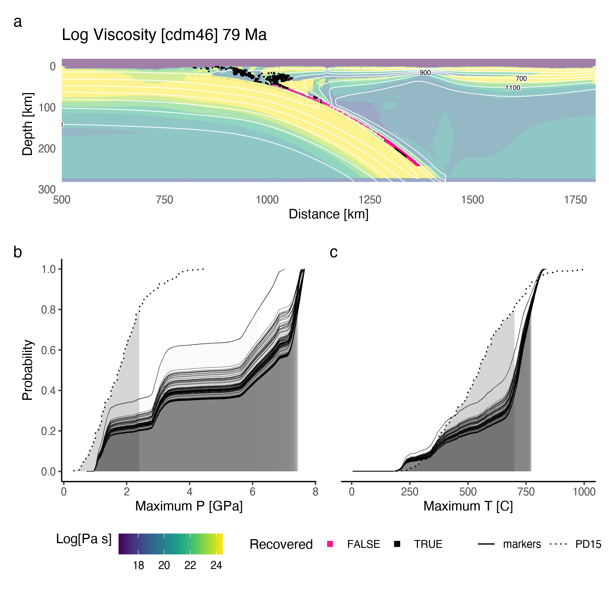
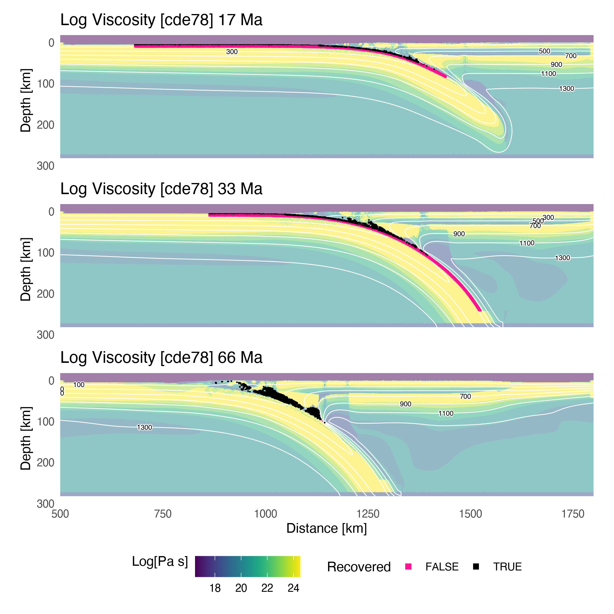
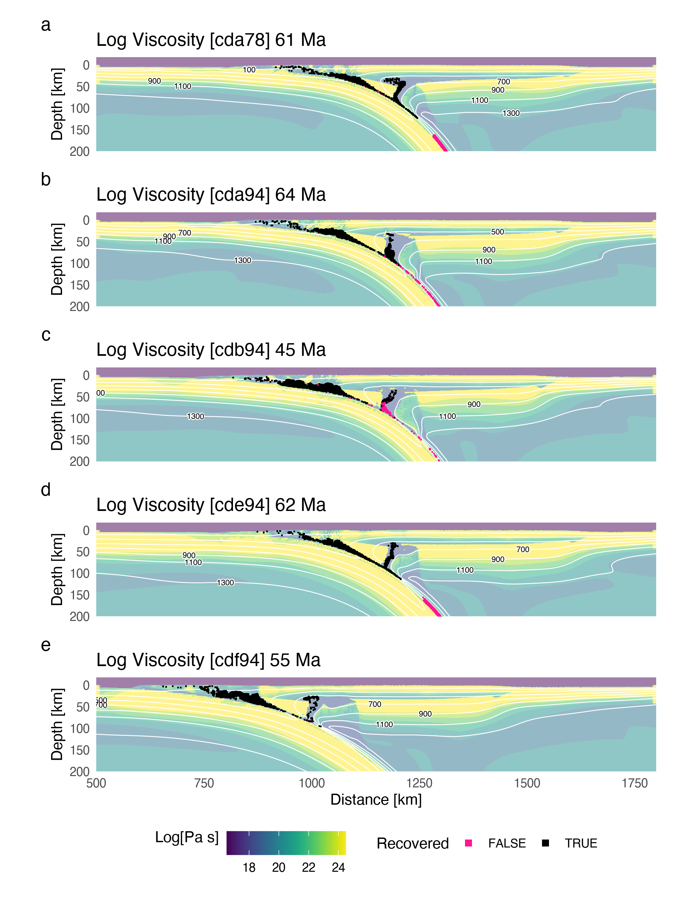

```{r echo=FALSE, message=FALSE}
# Some recommended settings
knitr::opts_chunk$set(
  echo=FALSE,
  message=FALSE,
  fig.pos='h',
  out.extra="",
  fig.align='center',
  out.width='98%'
)

# Run R code

# Load functions and libraries
source('../functions.R')

# Read Penniston-Dorland et al., 2015 dataset
cat('\nReading Penniston-Dorland 2015 ...')
pd15 <- readr::read_delim('../data/PD15.tsv', delim = '\t', col_types = 'cddcccd')
pd15 <- pd15[1:nrow(pd15)-1,]

tibble(T = sort(pd15$temperature)) %>%
mutate(cdf = (row_number()-1)/n()) -> pd15T

# Load numerical model parameters
load('../data/mods.RData')

# Get file paths
cat('\nReading classified marx ...')
paths <- list.files('../data/k10', full.names = T)
models <- paths %>% stringr::str_extract('cd.[0-9]+')

# Load classified markers
for (i in paths) load(i)

# Save as list
purrr::map(ls()[grep('classified', ls())], ~get(.x)) %>%
purrr::set_names(models) -> m

# Clean up environment
rm(list = ls()[grep('classified', ls())])

# Time cuts
tcuts <- purrr::map_dbl(m, ~attr(.x$marx, 'tcut'))

# Number of markers by model
purrr::map_df(m, ~{
  .x$marx %>%
  slice(1) %>%
  ungroup() %>%
  summarise(n = n())
}, .id = 'model') -> marx.summary

# Combine marx and model data
mods.summary <- mods %>%
select(model, phi, zc, z1100, age, cv) %>%
left_join(marx.summary, by = 'model') %>%
mutate(tcut = tcuts, .before = 'phi')

# Summarise marker stats by model
purrr::map_df(m, ~{
  .x$jk %>%
  purrr::map_df(~purrr::pluck(.x, 'stats'), .id = 'run') %>%
  summarise(
    mean.rec = mean(rec),
    sd.rec = sd(rec),
    mean.sub = mean(sub),
    sd.sub = sd(sub),
    mean.ratio = mean(ratio),
    sd.ratio = sd(ratio)
  )
}, .id = 'model') -> stats.summary

# Combine tables
d <- mods.summary %>% left_join(stats.summary, by = 'model')

# Summarise pressure CDF
purrr::map_df(m, ~{
  .x$marx %>%
  filter(recovered == TRUE)
}, .id = 'model') %>%
group_by(id, model) %>%
summarise(maxP = max(P), .groups = 'keep') %>%
left_join(select(mods, model, z1100), by = 'model', .before = 'data') %>%
group_by(z1100) %>%
nest() -> d1

maxP <- d1$data %>%
purrr::map_df(~.x %>% arrange(maxP) %>% mutate(cdf = (row_number()-1)/n())) %>%
arrange(model) %>%
left_join(select(mods, model, z1100), by = 'model')

# Summarise temperature CDF
purrr::map_df(m, ~{
  .x$marx %>%
  filter(recovered == TRUE)
}, .id = 'model') %>%
group_by(id, model) %>%
summarise(maxT = max(T), .groups = 'keep') %>%
left_join(select(mods, model, z1100), by = 'model', .before = 'data') %>%
group_by(z1100) %>%
nest() -> d2

maxT <- d2$data %>%
purrr::map_df(~.x %>% arrange(maxT) %>% mutate(cdf = (row_number()-1)/n())) %>%
arrange(model) %>%
left_join(select(mods, model, z1100), by = 'model')

# Load markers and grids for model cde78
load('../data/k10/cde78_k10_marx_classified.RData')
# Max P summary for CDFs
cde78.marx.classified$jk %>%
purrr::map_df(~.x$cdfP, .id = 'run') -> maxP.cde78
# Max T summary for CDFs
cde78.marx.classified$jk %>%
purrr::map_df(~.x$cdfT, .id = 'run') -> maxT.cde78
```

# Introduction

Maximum metamorphic conditions, in terms of pressure and temperature (PT), have now been estimated for hundreds of high-pressure rocks exhumed from subduction zones [@agard2018; @penniston2015]. This dataset (the *rock record*) is the only tangible record of PT conditions experienced by rocks during deformation and chemical processing in subduction systems [e.g., @agard2009]. Together with geophysical imaging [@naif2015; @hyndman2003; @syracuse2006; @ferris2003; @rondenay2008], surface heat flow [@kerswell2021; @currie2006; @gao2014; @wada2009; @hyndman2005], and forward numerical modelling [@gerya2002; @sizova2010; @gerya2006; @gerya2008; @syracuse2010; @yamato2007; @yamato2008; @hacker2003; @peacock1990; @peacock1996; @mckenzie1969], the rock record underpins contemporary understanding of subduction geodynamics [@agard2009; @agard2018; @bebout2007]. However, two interesting observations emerge from the rock record that remain contradictory or unexplained by geophysical observations and numerical models.

***Observation one:*** *temperature estimates for rocks are up to $300^\circ C$ warmer, at P < 2 $GPa$, than widely cited numerical models of subduction* [@penniston2015]. This significant temperature discrepancy implicates both geodynamic modelling and thermobarometry alike. Potential explanations for the relatively high T conditions recorded by rocks are discussed by @penniston2015 and recapitulated by @abers2017, @kohn2018, and @vankeken2019 with conflicting claims. In any case, only one set of numerical experiments from @syracuse2010 has been systematically compared to the rock record. Comparing the rock record with other widely used geodynamic codes [e.g. `I2VIS`, @gerya2003] may resolve recurrent incongruities or uncover new ones. Most importantly, hypotheses about metamorphic reactions, mechanics, seismicity, volcanism, and chemical fluxes are often generated and tested using forward numerical models---warranting further investigation into incompatible PT conditions recorded by rocks and predicted by models.

***Observation two:*** *the likelihood of recovering high-pressure rocks from pressures below `r round(tail(pd15$pressure[pd15$cumulative <= 0.8], 1), 1)` $GPa$ is approximately equal, but rapidly diminishes above `r round(tail(pd15$pressure[pd15$cumulative <= 0.8], 1), 1)` $GPa$  ([@fig:ecdf]a)*. [@fig:ecdf]a implies a probabilistic limit for recovering high-pressure rocks. The curve may point to a not-yet-understood geodynamic feature operating at `r round(tail(pd15$pressure[pd15$cumulative <= 0.8], 1), 1)` $GPa$. Alternatively, it may just be a consequence of mixing PT estimates from many independent subduction zones.

Perhaps coincidentally, hypotheses of commonly thin backarcs [@currie2006] and common depths of mechanical coupling along the subduction interface [@furukawa1993; @wada2009] may help explain the recovery depth limit implied by [@fig:ecdf]a. However, such commonalities among subduction zone thermal structure and mechanical coupling was recently scrutinized by interpolations of surface heat flow [@kerswell2021]. Nevertheless, subduction zone thermal structure is likely related to maximum recovery depth of high-pressure rocks [@kerswell2020]. Explaining ***observation two***, therefore, may help explain ***observation one*** by association.

![Empirical cmulative distribution function of peak metamorphic pressures (a) and temperatures (b) for a global compilation of exhumed blueschists and eclogites. The rock record implies eighty percent (grey shaded regions) of rocks are recovered from $\leq$ `r round(tail(pd15$pressure[pd15$cumulative <= 0.8], 1), 1)` $GPa$ and $\leq$ `r round(tail(pd15T$T[pd15T$cdf <= 0.8], 1))` $^{\circ} C$. Note the abrupt change in slope at `r round(tail(pd15$pressure[pd15$cumulative <= 0.8], 1), 1)` $GPa$. Data from @penniston2015.](../figs/pd15_cdf.png){#fig:ecdf width=95%}

This study addresses the above observations by asking the following question: *what is the global distribution of maximum PT conditions for subducted oceanic crust and seafloor sediments?* We attempt to reproduce the rock record ([@fig:ecdf]) by first tracing more than one million markers in geodynamic numerical models of 64 active continental margins [from @kerswell2020]. Traced markers are then classified as recovered or subducted using unsupervised machine learning. Finally, marker motions, proportions, and maximum PT conditions are computed, visualized, and compared to the rock record. We end by discussing mantle wedge mechanics, spontaneous diapirs, marker recovery rates, and inconsistent pressures between markers and rocks.

\clearpage

# Methods {#sec:methods}

This study presents a dataset of Lagrangian markers (described below) from the numerical experiments of @kerswell2020. The numerical experiments simulate 64 oceanic-continental subduction systems with variable oceanic plate age, convergence velocity, and upper plate (continental) lithospheric thickness. The range of oceanic plate ages and convergence velocities broadly represent the modern global subduction system [@syracuse2006; @wada2009]. Initial conditions were modified from previous studies of active margins [@sizova2010; @gorczyk2007]. The code, `I2VIS`, models visco-plastic flow of geologic materials by solving three conservative equations of mass, energy, and momentum on a fully-staggered finite difference grid with a *marker-in-cell* technique [@gerya2003; @harlow1965]. Further details about the initial setup and boundary conditions, rheologic model, metamorphic (de)hydration reactions, are in @kerswell2020. Details about the marker-in-cell technique are in @gerya2003 and @gerya2019.

In this section we first define Lagrangian markers (now referred to as markers) and briefly elaborate on their usefulness in understanding fluid flow---including geodynamic problems like subduction. We then detail the maths and decisions involved in our marker classification algorithm, which we use to classify `r format(round(sum(marx.summary$n)), big.mark = ',')` markers from 64 numerical experiments of @kerswell2020 as either subducted or recovered based on characteristics of their pressure-temperature-time (PTt) paths. At the heart of our marker classification algorithm is a finite Gaussian mixture model (GMM) fit by Expectation-Maximization [EM, @dempster1977]. We derive GMM in @sec:gmm and EM in @sec:em. Please note that GMM and EM are general purpose approaches broadly used in many scientific fields for pattern recognition, anomaly detection, and estimating complex probability distribution functions [e.g., @banfield1993; @celeux1995; @figueiredo2002; @fraley2002; @vermeesch2018].

## Lagrangian markers

Markers are mathematical objects representing discrete parcels of fluid flowing in a continuum [@harlow1962; @harlow1964]. Imagine tracking millions of parcels of air as they collectively move around an air foil. Each marker would experience a different flow path and pressure history relative to its neighbors. For example, some parcels of air may spin off and cause turbulence, while others move orderly with their neighbors around the foil. Knowing which parcels experience turbulence, perhaps based on some characteristic of a parcel's flow path, is useful information for aerodynamic testing. Tracing markers is distinctly advantageous for gaining similar insights into subduction dynamics in the following two ways.

First, tracing markers is like tracing a rock's PTt history. It is necessary, of course, to first accept many assumptions about the continuum including incompressibility [@batchelor1953; @boussinesq1897], a petrologic model governing phase changes [@ito1971; @schmidt1998], and highly non-linear rheologic models relating stress and strain by empirical flow laws [@hilairet2007; @ranalli1995; @karato1993; @turcotte2002]. Nevertheless, insofar as subducting crustal rocks on Earth behave like an incompressible visco-plastic fluid [as parameterized by @gerya2019; @kerswell2020; @gerya2003], principled comparisons between marker PTt paths and the rock record [e.g., @agard2018; @penniston2015] may be made.

Second, markers deform in a partly layered, partly chaotic, visco-plastic continuum known as a *subduction interface* or *subduction channel* [@gerya2002]. Current conceptual models of the subduction interface epitomize a geologic continuum with complex geometry and structure, sharp thermal, chemical, and strain gradients, strong advection, and abundant fluid flow [@agard2016; @agard2018; @bebout2002; @bebout2007; @gerya2003; @syracuse2010; @penniston2015]. Interpolating and updating temperature, strain, and chemical fields with markers greatly improve solution accuracy and stability in such cases with strong gradients [@gerya2003; @gerya2019; @moresi2003].

## Maker classification

On average, `r format(round(mean(marx.summary$n)), big.mark = ',')` markers are selected from within a 760 $km$ wide and 8 $km$ deep section of oceanic crust and seafloor sediments ([@fig:init]). Tracing proceeds for $t_{dur} = 79$ timesteps, which is sufficient for markers to be deeply subducted ($\geq 200~km$) from their initial positions for most models (see @sec:tdur). However, only markers detached and *recovered* from the subducting slab are relevant for comparison with PT estimates of natural rocks. The main challenge, therefore, is to first determine which markers are *subducted* or *recovered* without knowing their fate *a priori*. Below we describe a two-part classification algorithm that first clusters nondescript markers based on their PTt paths before using simple rules to determine which clusters and individual markers are *recovered* vs. *subducted*.

{#fig:init width=95%}

### Gaussian mixture model {#sec:gmm}

Let the traced markers represent a $d$-dimensional array of $n$ random independent variables $x_i \in \mathbb{R}^{n \times d}$. Assume markers $x_i$ were drawn from $k$ discrete probability distributions with parameters $\Phi$. The probability distribution of markers $x_i$ can be modeled with a mixture of $k$ components:

$$ p(x_i | \Phi) = \sum_{j=1}^k \pi_j p(x_i | \Theta_j) $$ {#eq:gmix}

where $p(x_i | \Theta_j)$ is the probability of $x_i$ under the $j^{th}$ mixture component and $\pi_j$ is the mixture proportion representing the probability that $x_i$ belongs to the $j^{th}$ component $(\pi_j \geq 0; \sum_{j=1}^k \pi_j = 1)$.

Assuming $\Theta_j$ describes a Gaussian probability distributions with mean $\mu_j$ and covariance $\Sigma_j$, @eq:gmix becomes:

$$ p(x_i | \Phi) = \sum_{j=1}^k \pi_j \mathcal{N}(x_i | \mu_j, \Sigma_j) $$ {#eq:mix}

where

$$ \mathcal{N}(x_i | \mu_j, \Sigma_j) = \frac{exp\{ -\frac{1}{2}(x_i - \mu_j)(x_i - \mu_j)^T \Sigma_j^{-1}\}}{\sqrt{det(2 \pi \Sigma_j)}} $$ {#eq:gauss}

The parameters $\mu_j$ and $\Sigma_j$, representing the center and shape of each cluster, are estimated by maximizing the log of the likelihood function, $L(x_i | \Phi) = \prod_{i=1}^n p(x_i | \Phi)$:

$$ log~L(x_i | \Phi) = log \prod_{i=1}^n p(x_i | \Phi) = \sum_{i=1}^n log \left[ \sum_{j=1}^k \pi_j p(x_i | \Theta_j) \right] $$ {#eq:loglik}

Taking the derivative of @eq:loglik with respect to each parameter, $\pi$, $\mu$, $\Sigma$, setting the equation to zero, and solving for each parameter gives the Maximum Likelihood Estimators (MLE):

$$ \begin{aligned}
  N_j &= \sum_{i=1}^n \omega_{i} \\
  \pi_j &= \frac{N_j}{n} \\
  \mu_j &= \frac{1}{N_j} \sum_{i=1}^n \omega_{i} x_i \\
  \Sigma_j &= \frac{1}{N_j} \sum_{i=1}^n \omega_{i} (x_i - \mu_j)(x_i - \mu_j)^T
\end{aligned} $$ {#eq:mle}

where $\omega_{i}$ ($\omega_{i} \geq 0; \sum_{j=1}^k \omega_{i} = 1$) are membership weights representing the probability of an observation $x_i$ belonging to the $j^{th}$ Gaussian and $N_j$ represents the number of observations belonging to the $j^{th}$ Gaussian. Please note that $\omega_{i}$ is unknown for markers so MLE cannot be computed with @eq:mle. The solution to this problem in derived in @sec:em.

General purpose functions in the `R` package `Mclust` [@scrucca2016] are used to fit Gaussian mixutre models. After @banfield1993, covariance matrices $\Sigma$ in `Mclust` are parameterized to be flexible in their shape, volume, and orientation [@scrucca2016]:

$$ \Sigma_j = \lambda_j D_j A_j D_j^T $$ {#eq:eigen}

where $D_j$ is the orthogonal eigenvector matrix, $A_j$ and $\lambda_j$ are diagonal matrices of values proportional to the eigenvalues. This implementation allows fixing one, two, or three geometric elements of the covariance matrices. That is, the volume $\lambda_j$, shape $A_j$, and orientation $D_j$ of Gaussian clusters can change or be fixed among all $k$ clusters [e.g., @celeux1995; @fraley2002]. Fourteen parameterizations of @eq:eigen are tried, representing different geometric combinations of the covariance matrices $\Sigma$ [see @scrucca2016] and the Bayesian Information Criterion [BIC, @schwarz1978] is computed. The best parameterization for @eq:eigen is chosen by BIC.

### Expectation-Maximization {#sec:em}

The EM algorithm estimates GMM parameters by initializing $k$ Gaussians with parameters $(\pi_j, \mu_j, \Sigma_j)$, then iteratively computing membership weights with @eq:posterior (E-step) and updating Gaussian parameters with @eq:mle (M-step) until convergence [@dempster1977].

The *expectation* (E-)step involves a "latent" multinomial variable $z_{i} \in \{1, 2, \dots, k\}$ representing the unknown classifications of $x_i$ with a joint distribution $p(x_i,z_{i}) = p(x_i | z_{i})p(z_{j})$. Membership weights $\omega_{i}$ are equivalent to the conditional probability $p(z_{i} | x_i)$, which represents the probability of observation $x_i$ belonging to the $j^{th}$ Gaussian. Given initial guesses for Gaussian parameters $\pi_j$, $\mu_j$, $\Sigma_j$, membership weights are computed using Bayes Theorem (E-step):

$$ p(z_{i} | x_i) = \frac{p(x_i | z_{i})p(z_{j})}{p(x_i)} = \frac{\pi_j \mathcal{N}(\mu_j, \Sigma_j)}{\sum_{j=1}^k \pi_j \mathcal{N}(\mu_j, \Sigma_j)} = \omega_{i} $$ {#eq:posterior}

and Gaussian estimates are updated during the *maximization* (M-)step by applying $\omega_{i}$ to ([@eq:mle]).

### Feature selection and final decisions

EM is sensitive to local optima and initialization [@figueiredo2002], so a number of features were computed from marker PTt paths and tested in combination. Redundant or useless features [e.g., @dy2004] were filtered out. We settled on two features:

$$\begin{aligned}
  maxP \leftarrow \max_{1 \leq t \leq t}P \\
  sumdP \leftarrow \sum_{1}^{t_{dur}} \Delta P
\end{aligned}$$ {#eq:bivar}

where $maxP$ and $sumdP$ represent the maximum pressure attained each marker's PTt path and the sum total of all pressure changes along each marker's PTt path, respectively. Up to ten Gaussian components are fit to the bivariate mixture model described by @eq:mix and @eq:bivar using EM ([@eq:posterior; @eq:mle]). This clustering step gives markers $x_i$ class labels $z_i \in \{1, \dots, k\}$ representing assignment to one of $k$ clusters ([@fig:class]a).

Classes assigned to markers by the clustering algorithm described above do not indicate whether a marker is recovered or subducted *per se*, so final decisions are made to classify whole clusters and individual markers as either *subducted* or *recovered*. The first decision is made by comparing cluster centroids ($\mu_j$, [@eq:mle]) to the overall distribution of $maxP$ and $sumdP$. Clusters with centroids $\mu_j$ below the median in either $maxP$ *or* $sumdP$ dimensions, classify as *recovered*. Next, *recovered* markers that lie above the median in both $maxP$ *and* $sumdP$ dimensions are considered misclassified and get assigned as *subducted*. Finally, all markers that have approximately equal $maxP$ and $sumdP$, within two kilobar, represent markers that have not deviated from a purely subduction path and are therefore classified as *subducted* ([@fig:class]b).

![Marker classification for model cdf78. Clustering assigns `r format(round(marx.summary$n[marx.summary$model == 'cdf78']), big.mark = ',')` markers into ten clusters according to each marker's maximum pressure and sum of all pressure changes along its PTt path (a). If a cluster's centroid is below the median $sumdP$ or $maxP$ of all markers (within the grey shaded region), it is classified as recovered (b). The size of centroid squares are proportional to the number of markers in a class.](../figs/k10/cde78_class.png){#fig:class width=95%}

\clearpage

# Results

## Classification accuracy

Typical measures of classification accuracy, like confusion matrices [@stehman1997] and cross-validation [@kohavi1995], leverage known information about the data to validate clustering results. Generally speaking, these methods check classes predicted by clustering with actual classes to quantify type I (false positive) and type II errors (false negative).

False negatives (type II error) are markers classified as subducted but actually recovered. Note that type II error is analogous to a biased rock record where only the proportion of recovered rocks that are exhumed to Earth's surface may be sampled. Therefore, some principled comparisons may still be made between the rock record and models with type II error.

False positives (type I error) are markers classified as recovered but actually subducted. Unlike type II error, type I error has no real corollary with the rock record since subducted rocks are unobservable by definition. Any type I error produced by the classifier is undesirable and uninterpretable in any real context.

Marker classes are not known *a priori*, however, so quantifying type I and II error is not possible. At a minimum, confidence in the classifier output can be computed with a straight-forward jackknife approach [@efron1992]. First, two percent of markers are randomly left out before applying the classification algorithm described in [@sec:methods]. Next, ECDFs and summary statistics, like the ratio of recovered markers, are computed. This procedure is repeated one-hundred times and to estimate the expected value (mean) and variance of the summary statistics for each model ([@tbl:marx.summary]).

```{r marx.summary, results='asis'}
pander::set.alignment('right', row.names = 'left')
d %>%
select(
  model,
  zc,
  z1100,
  age,
  cv,
  mean.rec,
  sd.rec,
  mean.sub,
  sd.sub,
  mean.ratio,
  sd.ratio
) %>%
mutate(
  'mean.ratio' = mean.ratio*100,
  'sd.ratio' = sd.ratio*100
) %>%
rename(
  '$z_{c}$\n$[km]$' = zc,
  '$z_{1100}$\n$[km]$' = z1100,
  '$\\vec{v}_{conv}$\n$[\\frac{km}{Ma}]$' = cv,
  'age\n$[Ma]$' = age,
  '$rec$' = mean.rec,
  '$sub$' = mean.sub,
  '$\\sigma_{rec}$' = sd.rec,
  '$\\sigma_{sub}$' = sd.sub,
  '$rec$\n$[\\%]$' = mean.ratio,
  '$\\sigma_{rec}$\n$[\\%]$' = sd.ratio
) %>%
pander::pandoc.table(
  split.tables = Inf,
  keep.line.breaks = T,
  round = c(rep(0, 9), 1, 2),
  caption = 'Classifier results {#tbl:marx.summary}',
  missing = '**'
)
```

Although not strictly quantifiable, type I and type II errors are qualitatively assessed by visualizing the geodynamic evolution and marker PT conditons of each model. Model cdm46 stands out because it demonstrates excessive type I error ([@fig:typeI; @fig:cdm46snaps; @fig:cdm46meta; @fig:cdm46class]). For example, a number of black squares are observed subducting beyond any chance of recovery (> 200 $km$) in [@fig:typeI]a. The ECDF shrinks and streches in proportion to the amount of type I error ([@fig:typeI]b). Please note the last fifty-percent of recovered markers in [@fig:typeI]b, which all having maximum pressures above 7 $GPa$. Removing the type I error in this case changes ECDF towards a less-biased result with respect to the rock record. It is clear, however, that removing all type I error from model cdm46 does not bring the marker ECDF remotely close to the rock record (we discuss this point in [@sec:rvm]).

Despite model cdm46, we observe low prevalence of type I error and variable amounts of type II error (see [@sec:vis]). We find the errors qualitatively acceptable, with the exception of model cdm46.

{#fig:typeI width=95%}

\clearpage

## Marker motions and proportions

Marker motions are constrained by juxtaposition of two features in the mantle: 1) a high-viscosity wedge of upper mantle in the forearc region (the *cold nose*), and 2) a low-viscosity serpentinized subduction channel. Channel geometry primarily depends on the water flux rate from the slab into the mantle and generally tapers with depth, finally terminating at the coupling depth $z_{cpl}$ [@tbl:marx.summary; @kerswell2020]. In most models, markers detached from the slab must travel within the low-viscosity serpentinized channel as they are hindered by mechanical coupling between the plates below and the high-viscosity *cold nose* above. The number of recovered markers underplated (stored) in the mantle wedge is proportional to the width of the low-viscosity channel.

{#fig:snaps width=95%}

In five of sixty-four models deeply subducted markers are unconstrained from above and rise as diapirs from the subduction channel near the coupling depth ([@fig:diapir]). This is made possible by complete *separation* of the cold nose from the upper plate. Separation is achieved by a reaction front [$ol \leftrightarrow ant + H_2O$, @schmidt1998] propagating from the oceanic plate to the weak lower continental crust. That is, separation of the *cold nose* is achieved under certain conditions by focused $H_2O$ flux from the slab rather than by deformation, as the *cold nose* has low strain rates and remains relatively stagnant.

{#fig:diapir width=95%}

On average `r round(mean(d$mean.ratio)*100)` percent of markers get recovered from subduction ([@tbl:marx.summary]). Without making bold assumptions, recovered marker proportions cannot be directly related to volumes of rock because markers are point features. Assuming the markers represent the entire 760 $\times$ 8 $km$ section of oceanic crust and seafloor sediments, subduction rates (all markers) range from `r d %>% summarise(rate = 760 * 8 / tcut) %>% min() %>% round()` to `r d %>% summarise(rate = 760 * 8 / tcut) %>% max() %>% round()` $km^2/Ma$. Recovery rates range from `r d %>% summarise(rate = mean.ratio * 760 * 8 / tcut) %>% min() %>% round()` to `r d %>% summarise(rate = mean.ratio * 760 * 8 / tcut) %>% max() %>% round()` $km^2/Ma$.

\clearpage

## Maximum recovery depths

![Maximum metamorphic conditons for markers recovered from model cde78. Maximum pressures for recovered markers (solid curves) range from `r round(head(maxP.cde78$maxP[maxP.cde78$cdf <= 0.8], 1)/1e4, 1)` to `r round(tail(maxP.cde78$maxP[maxP.cde78$cdf <= 0.8], 1)/1e4, 1)` (a) and only marginally overlap with the rock record (dotted curves). However, maximum temperatures for recovered markers range from `r round(head(maxT.cde78$maxT[maxT.cde78$cdf <= 0.8], 1)-273)` to `r round(tail(maxT.cde78$maxT[maxT.cde78$cdf <= 0.8], 1)-273)` (b) and show better agreement with the rock record than (a). PD15 dataset from @penniston2015.](../figs/k10/cde78_meta.png){#fig:meta width=95%}

\clearpage

# Discussion

## Metamorphic conditions of rocks and markers {#sec:rvm}

![Metamorphic conditions of markers grouped by models with different upper plate lithospheric thicknesses $z_{1100}$. Eighty percent (shaded regions under curves) of recovered markers (solid curves) reach maximum pressures between `r round(head(maxP$maxP[maxP$cdf <= 0.8], 1)/1e4, 1)` and `r round(tail(maxP$maxP[maxP$cdf <= 0.8], 1)/1e4, 1)` with ostensibly no markers reaching maximum pressures of less than one gigapascal (a). In general, markers are recovered from lower maximum pressures for models with thin upper plates ($z_{1100} \leq 62~km$) compared to models with thicker upper plates ($z_{1100} > 62~km$) due to differences in coupling depths between the oceanic plate and upper plate [see @kerswell2020]. Eighty percent of recovered markers reach maximum temperatures between `r round(head(maxT$maxT[maxT$cdf <= 0.8], 1)-273)` and `r round(tail(maxT$maxT[maxT$cdf <= 0.8], 1)-273)` (b). With respect to temperature, models with thin upper plates ($z_{1100} \leq 62~km$) show better agreement with the rock record (dotted line) compared to models with thicker upper plates ($z_{1100} > 62~km$). The rock record does not significantly overlap with maximum metamorphic conditions of markers regardless of model parameterization. PD15 dataset from @penniston2015](../figs/meta_all.png){#fig:metacomp width=95%}

## Cold nose geometry

## Diapirs

\clearpage

# Conclusion

# Open Research

\clearpage

\acknowledgments

We gratefully acknowledge high-performance computing support of the Borah compute cluster (DOI: [10.18122/oit/3/boisestate](10.18122/oit/3/boisestate)) provided by Boise State University’s Research Computing Department. This work was supported by the National Science Foundation grant OIA1545903 to M. Kohn, S. Penniston-Dorland, and M. Feineman.

\appendix

\clearpage

# Appendix

## Marker tracing duration {#sec:tdur}

Spontaneous sinking motion of the oceanic plate, as opposed to a fixed subduction rate [e.g., @syracuse2010; @wada2009], induces right-to-left plate motions as the sinking oceanic plate (the *slab*) provides a leftward horizontal force (known as *slab rollback*). Slab rollback eventually leads to mechanical interference (collision) between trench sediments and the stationary convergence region centered at 500 $km$ from the left boundary ([@fig:init]). The fixed, high-viscosity, convergence region acts as a barrier to the incoming sediments, deforming the accretionary wedge into a rapidly thickening pile. The sudden change in accretionary wedge geometry flattens the slab, causing intense mantle circulation and crustal deformation in the forearc and backarc regions. We consider the dynamics after interference begins unrepresentative of natural bouyancy-driven slab motion. Therefore, marker PTt paths are also increasingly meaningless after mechanical interference begins.

Although our classification algorithm uses a constant tracing duration $t_{dur} = 79$ for classification (see @sec:methods), we define another duration $t_{max}$, which is the maximum timestep used for calculating PTt paths. $t_{max}$ is chosen automatically for each model by computing the topographic surface profile through time. The timestep when the sediment pile deforming against the convergence region becomes the overall topographic high is selected to be $t_{max}$, usually within one or two timesteps after interference. Marker PTt paths from different models, therefore, represent approximately the same amount of total convergence in $km$, but different subduction durations.

\clearpage

## Visualizations {#sec:vis}

```{r vis, results = 'asis'}
for(i in seq_along(models)){
  cat('\n\n![Marker classification for model ', models[i], '.](../figs/k10/', models[i], '_class.png){#fig:', models[i], 'class width=95%}', sep = '')
  cat('\n\n![Metamorphic conditions of markers recovered from model ', models[i], '.](../figs/k10/', models[i], '_meta.png){#fig:', models[i], 'meta width=95%}', sep = '')
  cat('\n\n![Geodynamic evolution of model ', models[i], '.](../figs/k10/', models[i], '_snaps.png){#fig:', models[i], 'snaps width=95%}', sep = '')
  cat('\n\n\\clearpage')
}
```

\clearpage

# References
