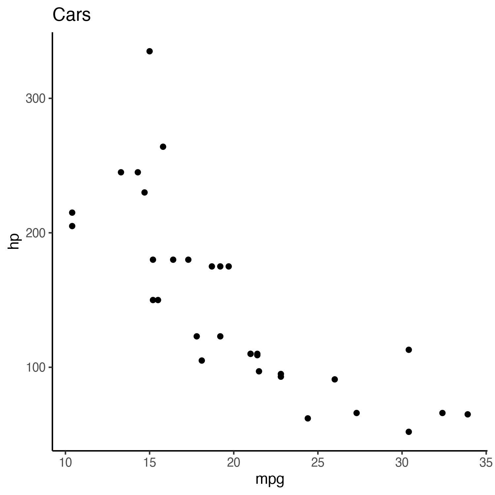

```{r echo=FALSE, message=FALSE}
# Some recommended settings
knitr::opts_chunk$set(
  echo=FALSE,
  message=FALSE,
  fig.pos='h',
  out.extra="",
  fig.align='center',
  out.width='95%'
)

# Load functions and libraries
library(magrittr)
library(dplyr)
library(ggplot2)
#suppressMessages(source('../functions.R'))
#suppressMessages(load('../data/'))

# Run R code
data(mtcars)
df <- mtcars

df %>%
summarise(
  n = n(),
  mean = mean(mpg),
  tot.hp = sum(hp),
  tot.cyl = sum(cyl)
) -> df.summary

df %>%
ggplot() +
geom_point(aes(x = mpg, y = hp)) +
labs(title = 'Cars') +
theme_classic() -> p

ggsave('cars.png', plot = p, width = 5, height = 5, device = 'png', type = 'cairo')

```

# Body

<!--Body with references -->

Heat escaping the solid Earth's surface indicates a dynamically cooling planet. Surface heat flow databases [@pollack1993; @hasterok2008; @lucazeau2019] enable investigation *everything is related, but nearer things are more related* [@krige1951; @matheron1963]. The spatial (dis)continuity of surface heat flow represents the areal extent of geodynamic processes and their interactions. For example, patterns of consistently low surface heat flow outline the areal extent of cratons ([@fig:lucahf]) 

## Figures

<!--Figure -->

<center>

{#fig:lucahf width=95%}

</center>

## Equations

Like @lucazeau2019, we exclude 4790 poor quality observations (Code 6 = D) from our analysis. We further remove 350 data points without heat flow observations and two without geographic information. Multiple observations at the same location are parsed to avoid singular covariance matrices during Kriging:

$$\begin{aligned}
  f(X_i^q, Y_i^q) &= \\
  X_i^q > Y_i^q &\rightarrow z_i = x_i \\
  X_i^q < Y_i^q &\rightarrow z_i = y_i \\
  X_i^q = Y_i^q &\rightarrow z_i = RAND(x_i, y_i)
\end{aligned}$$ {#eq:parse}

where $X_i^q$ and $Y_i^q$ represent the quality of each duplicate observation pair at location $i$, $RAND$ is a random function that selects either the observation $x_i$ or $y_i$, and $z_i$ stores the observation selected by $f(X_i^q, Y_i^q)$. The final dataset used for Kriging has $n=$ 55274 observations after parsing $n=$ 32430 duplicate observation. We use @eq:parse to 

## Code

You can link to code at [https://doi.org/10.17605/OSF.IO/CA6ZU](https://doi.org/10.17605/OSF.IO/CA6ZU).

~~~
+proj=robin +lon_0=-155 +lon_wrap=-155 +x_0=0 +y_0=0
+ellps=WGS84 +datum=WGS84 +units=m +no_defs
~~~

## Tables

```{r car.summary.table, results = 'asis'}
# Summarize data
df.summary %>%
knitr::kable(
  caption = 'Car ($mWm^{-2}$) observations {#tbl:cars.summary.table}',
  format = 'pandoc')
```

\clearpage <!--Use clearpage to print all figures above this line using pages as needed-->

<center>

{#fig:car.summary.plot width=65%}

</center>

# Lists

This study uses

1. Inconsistent patterns
2. Kriging and similarity
3. For testing hypotheses
4. Focused improvements
5. Improving Kriging

# Open Research

All data, code, and heat flow interpolations can be found at `https://doi.org/10.17605/OSF.IO/CA6ZU`, the official Open Science Framework data repository. All code is MIT Licensed and free for use and distribution (see license details, @sec:license).

\clearpage

\acknowledgments

We thank D. D for providing the NGHF. This work was supported by the National Science Foundation grant OIA1545903 to M. Kohn, S. Penniston-Dorland, and M. Feineman.

# References

<div id="refs_main"></div>

\appendix

\clearpage

# Appendix {#sec:license}

### License {#sec:license}

No license but a table in @tbl:search

|      Parameter      |                 Search Domain               |          Units          |
|---------------------|:-------------------------------------------:|------------------------:|
|    Lag Cutoff (c)   |                [$1/3$, $1/15$]              |            NA           |
|    Lag Window (w)   |                    [1, 5]                   |            NA           |
|      Model (m)      |            [Spherical, Exponential]         |            NA           |
|       Sill (s)      |              [1, $1000\sqrt{2}$]            |         $mWm^{-2}$      |
| Effective Range (a) |                   [1, 1000]                 |            km           |
|      Nugget (n)     |              [1, $1000\sqrt{2}$]            |         $mWm^{-2}$      |
|   Local Search (S)  |                  [1, 10000]                 |            km           |

: Parameters and ranges used in the optimization algorithm {#tbl:search}

# Randomness


